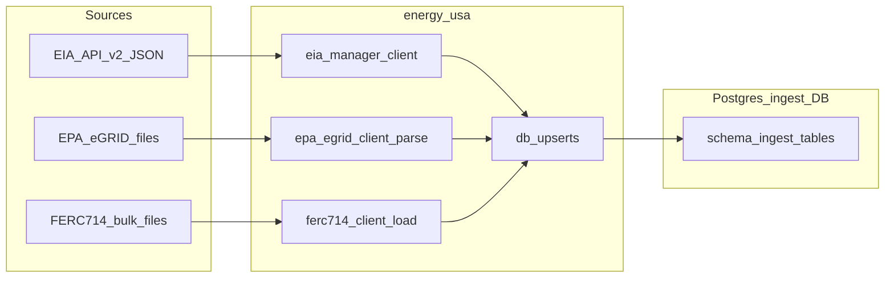

<!-- 59cde77b-18a9-4653-81df-84cb5a282ee4 -->
---
todos:
  - id: "schema-ingest"
    content: "Add `CREATE SCHEMA ingest` init SQL and first `ingest.*` table DDL; qualify upserts"
    status: pending
  - id: "eia-rto-wave"
    content: "Implement EIA RTO + facility-fuel + generator capacity: db modules, flows, backfill/deploy/run_local wiring"
    status: pending
  - id: "tdd-fixtures"
    content: "Add httpx.MockTransport unit tests with JSON fixtures; live gated smoke tests"
    status: pending
  - id: "ferc714-phase1"
    content: "FERC Form 714 bulk download client + CSV→`ingest.ferc714_*` loaders + tests"
    status: pending
  - id: "egrid-ingest"
    content: "EPA eGRID download + XLSX/CSV parse to `ingest.egrid_*` + annual Prefect flow"
    status: pending
  - id: "docs-ops"
    content: "Update docs/ingest-flows.md, data-analysis.md; mirror DDL in Proxmox postgres provision if applicable"
    status: pending
isProject: false
---
# Plan: EIA splits, EPA eGRID, FERC 714 → `ingest` schema

## Context (current repo)

- **Pattern to mirror:** [`src/energy_usa/flows/eia_retail_sales.py`](src/energy_usa/flows/eia_retail_sales.py) (paginated `EIAManager.get_electricity`), [`src/energy_usa/db/retail_sales.py`](src/energy_usa/db/retail_sales.py) (idempotent `INSERT … ON CONFLICT`), DDL in [`docker/postgres/init/ingest/*.sql`](docker/postgres/init/ingest/), wiring in [`src/energy_usa/flows/backfill_eia.py`](src/energy_usa/flows/backfill_eia.py) + [`scripts/deploy_ingest.py`](scripts/deploy_ingest.py) + [`scripts/run_local.py`](scripts/run_local.py).
- **HTTP stack:** `httpx` + [`src/energy_usa/eia/client.py`](src/energy_usa/eia/client.py) / [`src/energy_usa/eia/manager.py`](src/energy_usa/eia/manager.py); settings in [`src/energy_usa/config.py`](src/energy_usa/config.py).
- **Tests today:** DB upserts in [`tests/integration/test_db_upserts.py`](tests/integration/test_db_upserts.py) (real Postgres, skip if unreachable); no live EIA tests.

**Naming decision:** Introduce a real PostgreSQL schema `ingest` (`CREATE SCHEMA IF NOT EXISTS ingest;`) and put **all new tables** in `ingest.*`. Existing `public.eia_*` tables stay as-is for this effort (avoids breaking current exports/docs); optional later migration can move them behind a view.

## 1. PostgreSQL: `ingest` schema and DDL

- Add an init fragment (e.g. `docker/postgres/init/ingest/00-schema.sql`) that runs first: `CREATE SCHEMA IF NOT EXISTS ingest;` (and optionally `SET search_path` is **not** global—prefer **qualified** names in SQL and Python: `ingest.table_name`).
- For each new dataset, add `CREATE TABLE ingest.<name> (...)` with:
  - **Scalar columns only** (`TEXT`, `NUMERIC`, `INTEGER`, `DATE`, `TIMESTAMPTZ` for `ingested_at`); avoid `JSONB` unless a source field is unavoidably nested (default: flatten to extra columns or extra rows).
  - **Primary key / unique constraint** matching the natural grain (mirror EIA facets + `period`, OR eGRID plant id + year, OR FERC table primary keys from documentation).
- Document new tables in [`docs/ingest-flows.md`](docs/ingest-flows.md) and [`docs/data-analysis.md`](docs/data-analysis.md) (short column glossary).

## 2. Additional EIA datasets (“useful splits”)

Use the project’s EIA OpenAPI copy ([`.cursor/skills/eia-api/eia-api-swagger.yaml`](.cursor/skills/eia-api/eia-api-swagger.yaml)) to confirm facets, `data[]` columns, and date parameters for each route.

**Recommended first wave (highest analytic value, same client stack):**

| Focus | EIA v2 subpath (data) | Table (example) | Notes |
|--------|------------------------|-----------------|--------|
| RTO / ISO regional load & metrics | `electricity/rto/region-data/data` | `ingest.eia_rto_region_data` | Time + region facets; paginate like retail |
| RTO fuel mix | `electricity/rto/fuel-type-data/data` | `ingest.eia_rto_fuel_type_data` | Pairs with regional story |
| Sub-BA / finer grid | `electricity/rto/region-sub-ba-data/data` | `ingest.eia_rto_region_sub_ba_data` | Subdivision within markets |
| Facility-level fuel | `electricity/facility-fuel/data` | `ingest.eia_facility_fuel` | Large row counts—strict pagination + optional facet filters |
| Capacity by tech | `electricity/operating-generator-capacity/data` | `ingest.eia_operating_generator_capacity` | Complements generation tables |

**Second wave (optional):** `electricity/rto/interchange-data/data`, daily variants under `electricity/rto/daily-*`, and `electricity/state-electricity-profiles/emissions-by-state-by-fuel/data` for emissions-by-fuel at state level.

**Implementation steps per dataset:**

1. New module `src/energy_usa/db/<dataset>.py` with `upsert_*` targeting `ingest.<table>` (same `executemany` + `ON CONFLICT` style as [`retail_sales.py`](src/energy_usa/db/retail_sales.py)).
2. New flow `src/energy_usa/flows/eia_<dataset>.py`: fetch task (reuse `EIAManager`, explicit `data[]` column list like `EIA_RETAIL_SALES_DATA_COLUMNS`), upsert task, `Prefect` flow.
3. Extend `backfill_eia` dataset enum and `_get_ingest_flows` in [`backfill_eia.py`](src/energy_usa/flows/backfill_eia.py); extend `DATASETS` in [`scripts/run_local.py`](scripts/run_local.py).
4. Register deployments in [`scripts/deploy_ingest.py`](scripts/deploy_ingest.py) (monthly cron where source is monthly; document annual/daily exceptions).

## 3. “API infrastructure” for EPA eGRID

**Reality check:** eGRID is distributed primarily as **versioned Excel/CSV downloads** from EPA ([eGRID detailed data](https://www.epa.gov/egrid/detailed-data)), not an EIA-style JSON API. Treat “API infrastructure” as a **small, testable client layer**:

- New package area, e.g. `src/energy_usa/epa/`:
  - `egrid_client.py`: configurable **base URL or file path** (env: `EGRID_DATA_URL` or similar), `httpx` download with timeouts/retries (reuse patterns from `EIAManager` or a thin `DownloadManager`).
  - `egrid_parse.py`: map **each major sheet** (e.g. PLNT, SUBR, etc.—exact list from the chosen file vintage) to **one relational table** under `ingest.egrid_*`, with columns aligned to EPA headers (snake_case), numeric typed where safe.
- Dependencies: add a parser dependency to the **main** or a dedicated optional extra (e.g. `openpyxl` and/or `pandas`—today `pandas` is only under `[project.optional-dependencies] web`; for worker ingest, either promote minimally needed libs to base deps or add `project.optional-dependencies ingest` and install that in the Prefect worker image/Makefile).

**Postgres shape:** one table per major eGRID entity (plant, subregion, state, etc.), include `data_year INT NOT NULL` and `ingested_at`, PK = EPA-defined keys + year.

**Prefect:** annual (or on-demand) flow `ingest-epa-egrid` with parameter `year=2022` (etc.), not monthly.

## 4. “API infrastructure” for FERC Form 714

**Reality check:** FERC publishes Form 714 as **bulk relational files** (notably the **2006–2010 CSV database** and other archives) and **XBRL for 2011+** ([FERC Form 714 data](https://www.ferc.gov/industries-data/electric/general-information/electric-industry-forms/form-no-714-annual-electric/data)). There is no EIA-like unified JSON API in scope.

**Phase 1 (raw-faithful, tabular):**

- `src/energy_usa/ferc/` (or `energy_usa/ferc714/`):
  - `form714_client.py`: download ZIP/CSV from a **pinned, documented URL** (env `FERC714_BULK_URL`); verify size/content-type; optional SHA256 check.
  - `form714_load.py`: load each CSV into `ingest.ferc714_<original_table_name>` with **TEXT columns mirroring headers** (or mapped 1:1 to snake_case) + `source_vintage TEXT`, `ingested_at TIMESTAMPTZ`; use `NUMERIC` only where the entire column is clearly numeric after profiling.
- **Phase 2 (optional, separate PR):** 2011+ XBRL extraction pipeline (heavier); or document consuming **PUDL** outputs under their license if you prefer normalized third-party extracts.

## 5. Configuration

Extend [`src/energy_usa/config.py`](src/energy_usa/config.py) with optional settings: EPA/FERC URLs, timeouts, max retries, file paths; keep secrets out (these sources are generally public).

## 6. Test-driven development (TDD) — “populated data” guarantees

Follow red → green → refactor per vertical slice (one dataset end-to-end before starting the next).

### A. Unit tests (default CI — no network)

1. **Record fixtures:** For EIA, save a **redacted** real JSON page under `tests/fixtures/eia/<route>_sample.json` (trim to a few rows; keep `response.total`, `response.data` shape).
2. **HTTP mocking:** Use `httpx.MockTransport` (no new dev dependency required) or `pytest-httpx` if you prefer; assert:
   - Parser/fetch returns `len(rows) >= N` for the fixture.
   - Required keys exist and at least one numeric field parses.
3. **eGRID / FERC:** Commit a **tiny truncated** XLSX/CSV under `tests/fixtures/`; tests assert row counts and that upsert SQL is generated for non-empty batches.

### B. Parser / normalization tests

- Tests for `normalize_period`-style helpers where new frequencies appear (daily vs monthly vs annual), mirroring [`tests/unit/test_period.py`](tests/unit/test_period.py).

### C. DB integration tests

- Extend [`tests/integration/test_db_upserts.py`](tests/integration/test_db_upserts.py) (or add `tests/integration/test_ingest_schema_upserts.py`) for each new `upsert_*`: insert synthetic row → `SELECT` → idempotent second upsert.

### D. Live / smoke tests (off by default)

- New marker e.g. `@pytest.mark.live_api` and gate with `RUN_LIVE_APIS=1` plus `EIA_API_KEY`.
- Each live test:
  - Uses a **narrow window** (one month or small facet) to limit load.
  - Asserts `total > 0` (or `len(data) > 0`) and spot-checks non-null rates on key columns.
- **eGRID/FERC live tests:** optional `RUN_LIVE_DOWNLOADS=1` hitting pinned URLs; mark as `integration` and skip in CI unless secrets/allowlist network is desired.

This gives **TDD proof** that the client returns populated structures **in CI** (fixtures), and **production confidence** via optional live checks.

## 7. Documentation and ops

- Update [`docs/ingest-flows.md`](docs/ingest-flows.md): new datasets, env vars, cadence, backfill examples.
- Proxmox: if [`deploy/proxmox/provision/postgres.sh`](deploy/proxmox/provision/postgres.sh) applies DDL separately from Docker, mirror the same new SQL there (grep for how ingest DDL is synced today).

## Architecture sketch

## Suggested implementation order

1. Schema bootstrap + one **EIA** dataset end-to-end (RTO region-data): tests with fixture → flow → deploy entry → docs.
2. Remaining EIA datasets in the first wave (reuse the same test template).
3. FERC 714 Phase 1 (CSV bulk): smallest blast radius, good “raw fidelity” story.
4. eGRID (sheet → typed tables): depends on chosen parser libs and sheet mapping work.

## Risks / trade-offs

- **Volume:** `facility-fuel` may require facet sharding or longer timeouts; plan pagination defaults like existing operational flow.
- **Schema drift:** EPA/FERC column sets change by vintage; include `source_vintage` / `file_sha256` columns where helpful.
- **2011+ FERC 714:** XBRL is a significant scope increase—defer unless you explicitly want it in v1.
