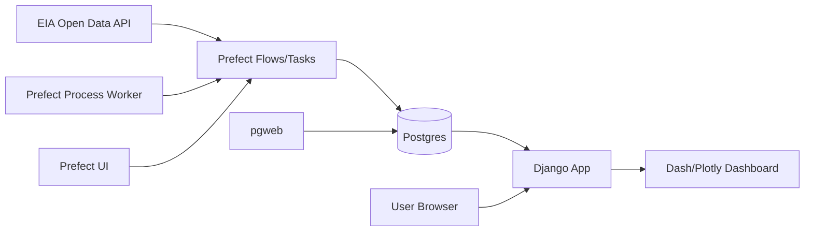
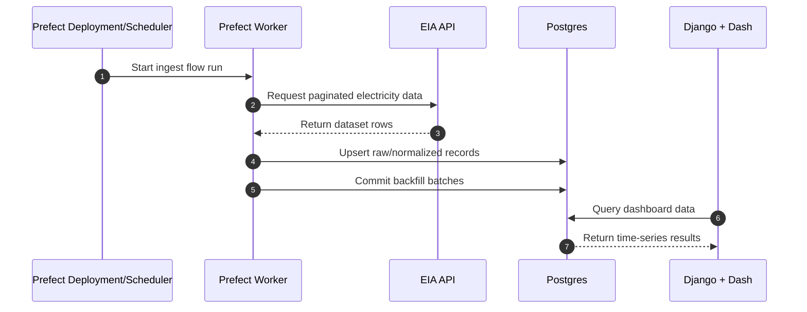

# Energy USA

Live and historical US energy data in Postgres (ingested via Prefect from EIA). Web app: Django with Dash (plotly) dashboard.

## Setup

1. Install [uv](https://docs.astral.sh/uv/)
2. Get an EIA API key from [EIA Open Data](https://www.eia.gov/opendata/register.php)
3. Create and populate `.env` in project directory using `.env.example` template
    - `cp .env.example .env`
    - Must update `EIA_API_KEY` with key from #2
    - May set custom postgres username/password (OPTIONAL)
4. Start the initial Docker Compose stack
    - `./dock.sh up`
5. Create Prefect work pool (one-time setup)
    - `./dock.sh worker-pool`
6. Deploy ingest flows to Prefect
    - `./dock.sh deploy`
7. Run initial data backfill (all electricity datasets)
    - `./dock.sh run ingest-eia-electricity-all`

## Architecture



## Data Flow



## Docker Compose

Use **`./dock.sh`** to manage the stack (or run `docker compose` directly):

```bash
./dock.sh up              # Start all services
./dock.sh worker-pool     # Create Prefect process work pool (only needed once)
./dock.sh deploy          # Register ingest deployments
./dock.sh run backfill-eia --param date_start=2024-01 --param date_end=2024-12  # Run backfill for a date range
./dock.sh logs [service]  # Tail logs; ./dock.sh help for all commands
```

### Prefect job date ranges

All ingest and backfill flows accept `date_start` / `date_end` in `YYYY-MM` format.

- If omitted, defaults are resolved as:
  - `date_start`: last calendar month
  - `date_end`: current month
- This default window ensures the prior completed month is included in EIA queries.
- `ingest-eia-state-summary` requests EIA with `frequency=annual`, so the month range is converted to years internally, and `period` is stored as `DATE` on `YYYY-01-01`.
- `backfill-eia` now supports omitted date parameters; when omitted it uses the same default range behavior, then splits the resolved window by `chunk_months`.

Examples:

```bash
# Use defaults (last calendar month -> current month)
./dock.sh run backfill-eia

# Explicit monthly range across all datasets
./dock.sh run backfill-eia --param date_start=2024-01 --param date_end=2024-12 --param dataset=all

# Chunk a long range into quarterly runs (3 months per child run)
./dock.sh run backfill-eia --param date_start=2020-01 --param date_end=2024-12 --param chunk_months=3 --param dataset=retail_sales
```

- **Django web app** (dashboard): http://localhost:8000  
- **Prefect UI** (job orchestration): http://localhost:4200  
- **Jupyter** (notebooks): http://localhost:8888  
- **pgweb** (Postgres browser): http://localhost:8080  

To run the web app locally (with Postgres and data already present):  
`uv sync --extra web` then `PYTHONPATH=web uv run python web/manage.py runserver`. Set `DATABASE_URL` in `.env` or the environment.

Or without the script: `docker compose up -d`, then create the work pool and run `PREFECT_API_URL=http://localhost:4200/api uv run python scripts/deploy_ingest.py` to deploy jobs.

### Jupyter notebooks

Notebooks run in the `jupyter` service and can query Postgres via the project helper. Use the `notebooks/` directory (mounted at `/app/notebooks` in the container); set `DATABASE_URL` or `INGEST_DATABASE_URL` from the environment. Example in a notebook cell:

```python
import os
from energy_usa.db import query_to_dataframe

url = os.environ["INGEST_DATABASE_URL"]
df = query_to_dataframe(url, "SELECT period, stateid, sectorid, sales FROM eia_retail_sales LIMIT 100")
df.head()
```

See [.cursor/skills/jupyter-postgres/SKILL.md](.cursor/skills/jupyter-postgres/SKILL.md) for the full notebook and Postgres workflow.

### Docker build: proxy / `http.docker.internal` errors

If `docker compose up` or `./dock.sh up` fails with:

```text
failed to resolve source metadata for ... proxyconnect tcp: dial tcp: lookup http.docker.internal ... connection refused
```

Docker is trying to use a proxy (often `http.docker.internal`) and the proxy or Docker’s internal DNS is unreachable. Fix it on your machine:

1. **Docker Desktop** → Settings → Resources → **Proxies**: turn off “Manual proxy configuration” if you don’t need it, or set **Bypass** for `registry-1.docker.io` and `ghcr.io` so image pulls don’t go through the proxy.
2. **Environment**: Unset `HTTP_PROXY` / `HTTPS_PROXY` (and `http_proxy` / `https_proxy`) in the shell before running `docker compose`, or set `NO_PROXY=*` so the daemon doesn’t use the proxy for registry requests.
3. Restart Docker Desktop after changing proxy settings, then run `./dock.sh up` again.

## License

This project is licensed under the GNU Affero General Public License v3.0.
See LICENSE file for details.
