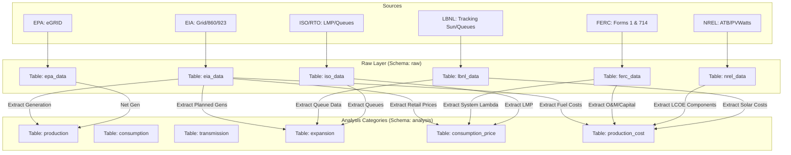

# Energy USA Data Model

This document details the data architecture of the `energyusa` package, tracing the flow of data from external sources through raw ingestion, transformation, and final display.

## 1. Data Sources & Dataset Catalog

This section lists specific datasets targeted for extraction, mapped to the system's analysis categories: **Production**, **Consumption**, **Transmission**, **Expansion**, **Consumption Price**, and **Production Cost**.

### U.S. Energy Information Administration (EIA)
*API Key Required. Time-series data.*

| Category | Dataset / Series | API Path / ID | Description |
| :--- | :--- | :--- | :--- |
| **Production** | Hourly Electric Grid Monitor | `electricity/rto/region-data` | Net generation by energy source (Solar, Wind, Hydro, Fossil) for Balancing Authorities. |
| **Production** | Monthly Generation | `electricity/electric-power-operational-data` | Detailed state-level generation by fuel type. |
| **Consumption** | State Energy Data System (SEDS) | `seds/data` | Annual consumption estimates (MSN: `TETCB` - Total Energy Total Consumption). |
| **Consumption** | Electricity Sales | `electricity/retail-sales` | Monthly sales to ultimate customers by sector. |
| **Transmission** | Grid Monitor Interchange | `electricity/rto/interchange-data` | Hourly physical interchange (import/export) between regions. |
| **Expansion** | Generator Construction | `electricity/operating-generator-capacity` | Annual data on existing and planned generators, including ownership, technology type, and status (Planned, Operating, Retired). |
| **Consumption Price** | Average Retail Price | `electricity/retail-sales` | Average price of electricity (cents/kWh) by state/sector. |
| **Production Cost: Fuel** | Fossil Fuel Costs | `electricity/facility-fuel` | Monthly and annual average cost of fossil fuels (coal, gas, oil) for generation by plant/sector (Form 923). |

### Federal Energy Regulatory Commission (FERC)
*File-based (XBRL/XLSX).*

| Category | Dataset | Form/Report | Description |
| :--- | :--- | :--- | :--- |
| **Transmission** | Annual Planning Report | **Form 714** | Hourly balancing authority area load and system lambda (marginal price). |
| **Production Cost: O&M** | Electric Utility Annual Report | **Form 1** | Detailed financial report including Operating & Maintenance (O&M) expenses for generation, transmission, and distribution. |
| **Production Cost: Capital** | Electric Utility Annual Report | **Form 1** | Plant-in-service book values, depreciation, and capital additions. |
| **Production Cost: Transmission** | Electric Utility Annual Report | **Form 1** | Transmission plant investment and O&M expenses. |
| **Production Cost: Taxes** | Electric Utility Annual Report | **Form 1** | Taxes accrued and paid by utility companies. |
| **Production Cost: Decommissioning**| Electric Utility Annual Report | **Form 1** | Nuclear decommissioning trust fund balances and contributions. |
| **Production Cost: Financing** | Electric Utility Annual Report | **Form 1** | Interest charges and debt servicing costs. |

### EPA eGRID & CAMD
*File-based (XLSX) / API.*

| Category | Dataset | Source | Description |
| :--- | :--- | :--- | :--- |
| **Production** | eGRID Plant/Unit Data | eGRID | Annual net generation, heat input, and emissions by plant. |
| **Production Cost: Environ.** | Emissions Data | CAMD / eGRID | Emissions data (CO2, SO2, NOx) implying compliance costs (allowances/credits). |
| **Maintenance** | Plant Efficiency | eGRID | Heat rates (Btu/kWh) indicating thermal efficiency and operational status. |

### National Renewable Energy Laboratory (NREL)
*API / Geospatial.*

| Category | Dataset | Tool/API | Description |
| :--- | :--- | :--- | :--- |
| **Production Cost: Capital/O&M**| Annual Technology Baseline | **ATB** | Detailed cost projections (CAPEX, Fixed O&M, Variable O&M) for renewable and conventional technologies. |
| **Production Cost: Financing** | Annual Technology Baseline | **ATB** | Weighted Average Cost of Capital (WACC) and financing assumptions for energy projects. |
| **Production** | PVWatts | API | Estimated solar production potential based on system specs and location. |
| **Expansion** | ReEDS | Model Data | Regional Energy Deployment System model outputs for transmission capacity/expansion. |

### Lawrence Berkeley National Laboratory (LBNL)
*File-based (CSV/Excel).*

| Category | Dataset | Tool/Report | Description |
| :--- | :--- | :--- | :--- |
| **Production Cost: Capital** | Tracking the Sun | Report Data | Installed price trends for distributed photovoltaic systems (Dollar per Watt). |
| **Expansion** | Queued Up | Interconnection Data | Active, withdrawn, and energized generation projects in interconnection queues. |

### ISO/RTO Public Data (PJM, CAISO, ERCOT, etc.)
*API / CSV.*

| Category | Dataset | System | Description |
| :--- | :--- | :--- | :--- |
| **Consumption Price** | Locational Marginal Pricing | LMP Data | Real-time and Day-Ahead wholesale electricity prices at specific nodes. |
| **Expansion** | Interconnection Queue | ISO Queues | Granular project status data for specific regional grids. |

### OpenEI (DOE)
*API.*

| Category | Dataset | Database | Description |
| :--- | :--- | :--- | :--- |
| **Consumption Price** | U.S. Utility Rate Database | **URDB** | Detailed structure of electricity rates (tariffs) for all US utilities (Fixed, Time-of-Use, Demand charges). |

---

## 2. Raw Ingestion Layer (Schema: `raw`)

Data is first stored in a "hybrid" format: key identifiers are flattened into columns for indexing, while the full original payload is stored as a JSONB blob.

### Tables

#### `raw.eia_data`
- **id** (PK): Integer
- **api_path**: string (e.g., "electricity/rto/region-data")
- **period**: string (e.g., "2023-01-01T12")
- **value**: float
- **raw_json**: JSON

#### `raw.nrel_data`
- **id** (PK): Integer
- **endpoint**: string
- **raw_json**: JSON

#### `raw.ferc_data`
- **id** (PK): Integer
- **report_year**: integer
- **form**: string (e.g., "Form 1", "Form 714")
- **raw_json**: JSON (Parsed row)

#### `raw.epa_data`
- **id** (PK): Integer
- **year**: integer
- **raw_json**: JSON (Parsed row from eGRID)

#### `raw.lbnl_data`
- **id** (PK): Integer
- **year**: integer
- **dataset**: string (e.g., "tracking_the_sun", "queued_up")
- **raw_json**: JSON

#### `raw.iso_data`
- **id** (PK): Integer
- **iso**: string (e.g., "PJM", "CAISO")
- **dataset**: string (e.g., "LMP")
- **timestamp**: DateTime
- **raw_json**: JSON

---

## 3. Analysis Layer (Schema: `analysis`)

Normalized tables organized by the categories defined in `sources.md`.

### Tables

#### `analysis.production`
*Mapped from: EIA Grid Monitor, EIA SEDS, eGRID*
- **id** (PK): Integer
- **date**: DateTime
- **source**: string
- **fuel_type**: string
- **value**: float
- **unit**: string
- **state**: string

#### `analysis.consumption`
*Mapped from: EIA SEDS, EIA Retail Sales*
- **id** (PK): Integer
- **date**: DateTime
- **sector**: string
- **value**: float
- **unit**: string

#### `analysis.transmission`
*Mapped from: EIA Interchange, FERC Form 714*
- **id** (PK): Integer
- **timestamp**: DateTime
- **balancing_authority**: string
- **interchange_value**: float

#### `analysis.expansion` (Formerly Growth)
*Mapped from: EIA 860, LBNL Queued Up, ISO Queues*
- **id** (PK): Integer
- **project_id**: string
- **status**: string (e.g., "Planned", "Under Construction", "Queue")
- **capacity_mw**: float
- **technology**: string
- **location**: string (State/County)
- **expected_date**: Date

#### `analysis.consumption_price`
*Mapped from: EIA Retail Sales, ISO LMP, OpenEI URDB*
- **id** (PK): Integer
- **date**: DateTime
- **market_type**: string (e.g., "Retail", "Wholesale Real-Time", "Wholesale Day-Ahead")
- **location**: string (State, Zone, Node)
- **customer_class**: string (e.g., "Residential", "Industrial", "N/A")
- **price**: float
- **unit**: string (e.g., "cents/kWh", "$/MWh")

#### `analysis.production_cost`
*Mapped from: FERC Form 1, EIA Operating Data, NREL ATB, LBNL Tracking the Sun*
- **id** (PK): Integer
- **year**: Integer
- **cost_category**: string (e.g., "Fuel", "Capital", "O&M", "Transmission", "Taxes", "Financing")
- **metric**: string (e.g., "Cost per MWh", "Total Expense", "Installed Cost per Watt")
- **value**: float
- **unit**: string (e.g., "$/MWh", "USD", "$/W")
- **source**: string

#### `analysis.maintenance`
*Mapped from: eGRID (Heat Rates), FERC Form 1 (O&M Costs)*
- **id** (PK): Integer
- **asset_id**: string
- **status**: string
- **efficiency_metric**: float

---

## 4. Data Flow Diagram

