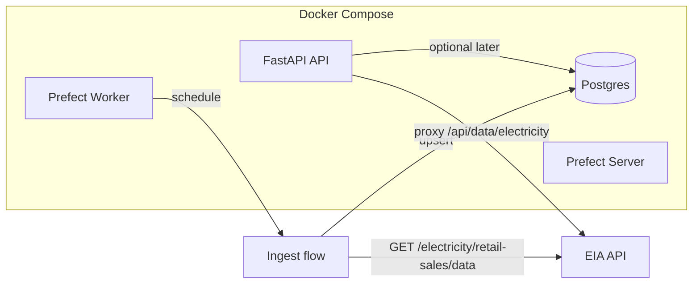

# Data Layer, EIA Data Fix, and Docker Compose

## 1. Why current EIA calls return metadata (not data)

The data router calls `get_electricity(subpath="retail-sales", ...)`, which hits `**/v2/electricity/retail-sales**`. That endpoint returns **dataset metadata** (name, description, facets, data column definitions, `startPeriod`/`endPeriod`). The terminal output you saw is that metadata response.

To get **actual time-series rows**, the EIA API requires the **data** subpath: `**/v2/electricity/retail-sales/data`** with the same query params (facets, `length`, `offset`). The swagger defines this at [eia-api-swagger.yaml](.cursor/skills/eia-api/eia-api-swagger.yaml) (e.g. lines 3331–3361). Response shape: `response.data` is an array of row objects (e.g. `period`, `stateid`, `sectorid`, `revenue`, `sales`, `price`, `customers`), plus `response.total` for pagination.

**Fix:** Use subpath `**retail-sales/data`** when the intent is to fetch data rows. The existing [routers/data.py](src/energy_usa/routers/data.py) default is `subpath="retail-sales"`; change the default (or the path construction) so that the electricity endpoint calls `**retail-sales/data`** and passes through `length` (max 5000), `offset`, and facet params. No client or manager signature change is required—only the subpath value passed from the router (and from the ingest job).

---

## 2. Data layer components (from PROJECT.md)

- **Postgres**: store ingested EIA data (ingest table only; no display/transformation tables in this scope).
- **Prefect**: orchestrate the single ingest job (schedule, run, retries).
- **FastAPI**: already present; will add optional DB connection for future read endpoints; for this scope it can remain as-is or only get config for `DATABASE_URL`.

No transformation jobs, no Django service.

---

## 3. Single ingest job: EIA electricity retail-sales → Postgres

- **What it does:**  
  - Call EIA `**electricity/retail-sales/data`** with facets and pagination (`length=5000`, `offset` in a loop until no more rows).  
  - Map each row into a single **ingest** table (e.g. `eia_retail_sales`: `period`, `stateid`, `sectorid`, `revenue`, `sales`, `price`, `customers`, `ingested_at`).  
  - Upsert into Postgres (e.g. `ON CONFLICT (period, stateid, sectorid) DO UPDATE`) so re-runs are idempotent.
- **Where it lives:**  
  - New Prefect flow(s) in the repo (e.g. `src/energy_usa/flows/` or `flows/`), using the existing [EIA client](src/energy_usa/eia/client.py) / [manager](src/energy_usa/eia/manager.py) for HTTP and new DB layer for inserts.  
  - Flow can be **synchronous** (sync HTTP + sync DB) to avoid mixing Prefect’s async with the current sync-capable EIAClient); if you prefer async, the manager already supports `get_electricity` async—worker can run async flow.
- **Schedule:**  
  - Monthly (or as per PROJECT.md: “monthly cadence whenever possible”).  
  - Implemented as a Prefect deployment with a cron/schedule.
- **Dependencies:**  
  - `prefect`, `psycopg` (or `asyncpg` if async), and existing `httpx`/EIA stack. Add to [pyproject.toml](pyproject.toml).

---

## 4. Postgres schema (ingest only)

- **One table**, e.g. `eia_retail_sales`:  
  - `period` (e.g. `date` or `text`), `stateid`, `sectorid`, `revenue`, `sales`, `price`, `customers` (nullable as needed), `ingested_at` (timestamp).  
  - Primary key or unique constraint on `(period, stateid, sectorid)` for upserts.
- Schema applied via init script or migration (e.g. SQL in `docker/postgres/init/` or a small migration tool). No “display” or transformation tables in this phase.

---

## 5. Docker Compose (single machine)

- **Services:**  
  - **postgres**  
    - Image: `postgres:16` (or 15).  
    - Env: `POSTGRES_USER`, `POSTGRES_PASSWORD`, `POSTGRES_DB` (e.g. `energy_usa`).  
    - Create a second DB for Prefect (e.g. `prefect`) via init script if Prefect uses Postgres for its API DB.  
    - Volume for data; healthcheck so other services can `depends_on: postgres` with condition.
  - **prefect-server**  
    - Image: `prefecthq/prefect:2-python3.12` (or build from same base as worker so versions match).  
    - Env: `PREFECT_API_DATABASE_CONNECTION_URL` if using Postgres for Prefect, or default SQLite.  
    - Expose API (e.g. port 4200).  
    - `depends_on`: postgres (if Prefect uses it).
  - **prefect-worker**  
    - **Custom image** that includes the project (e.g. `uv sync` or `pip install -e .`) so the ingest flow and EIA/DB code are available.  
    - Env: `PREFECT_API_URL=http://prefect-server:4200/api`, `EIA_API_KEY`, `DATABASE_URL` (app Postgres connection string for the ingest table).  
    - Command: e.g. `prefect worker start --pool default-pool --type process` (or current Prefect 2 worker start command).  
    - `depends_on`: prefect-server.
  - **api** (FastAPI)  
    - Dockerfile: install deps with `uv`, run `uvicorn energy_usa.main:app --host 0.0.0.0 --port 8000`.  
    - Env: `EIA_API_KEY`, optional `DATABASE_URL` for future use.  
    - `depends_on`: postgres (healthcheck).  
    - Expose 8000.
- **Networking:**  
  - All on one Compose network; services resolve by name (e.g. `postgres:5432`, `prefect-server:4200`).
- **Secrets:**  
  - `EIA_API_KEY` and DB credentials via env (e.g. `.env` or Compose `env_file`), not committed.
- **Single machine:**  
  - No Redis required for a minimal Prefect 2 setup (process worker). Add Redis later if you scale to multiple workers or need result persistence.

---

## 6. Configuration

- **App / worker:**  
  - Extend [config.py](src/energy_usa/config.py) with `database_url: str = ""` (or split host/port/user/password/db) for Postgres.  
  - In Docker, set `DATABASE_URL=postgresql://...` for the `energy_usa` database.
- **Prefect:**  
  - Worker and any flow that needs EIA/DB read config from env (`EIA_API_KEY`, `DATABASE_URL`). No Django settings.

---

## 7. EIA fix summary (API response)

- **Router:** In [routers/data.py](src/energy_usa/routers/data.py), when calling the electricity endpoint for “data” (current default behavior), use subpath `**retail-sales/data`** instead of `retail-sales`, so the response is the data payload (`response.data` array + `response.total`) instead of metadata.  
- **Optional:** Add a separate endpoint or query param for “metadata” (e.g. `?metadata=1` → `retail-sales` without `/data`) if you want to expose dataset description in the API. Not required for the ingest job.

---

## 8. File and code changes (summary)

| Area                 | Action                                                                                                                                                                                                 |
| -------------------- | ------------------------------------------------------------------------------------------------------------------------------------------------------------------------------------------------------ |
| EIA data vs metadata | Default electricity subpath to `retail-sales/data` in [routers/data.py](src/energy_usa/routers/data.py); document in docstring.                                                                        |
| Config               | Add `database_url` (and optionally `postgres`_*) in [config.py](src/energy_usa/config.py).                                                                                                             |
| DB layer             | New module (e.g. `db/` or `energy_usa/db/`) with connection helper and insert/upsert for `eia_retail_sales`; no ORM required.                                                                          |
| Ingest flow          | New Prefect flow: paginate EIA `retail-sales/data`, map rows, upsert into `eia_retail_sales`; use existing EIA client/manager.                                                                         |
| Schema               | SQL init script or one-off migration creating `eia_retail_sales` with unique (period, stateid, sectorid).                                                                                              |
| Dependencies         | [pyproject.toml](pyproject.toml): add `prefect`, `psycopg[binary]` (or `asyncpg`), keep existing deps.                                                                                                 |
| Docker               | New `Dockerfile` for FastAPI app; new `Dockerfile.worker` (or multi-stage) for Prefect worker with project code; `compose.yaml` with postgres, prefect-server, prefect-worker, api.                    |
| Docs                 | Update [.cursor/rules/PROJECT.md](.cursor/rules/PROJECT.md) to state that electricity API and ingest use `retail-sales/data` for data rows; add one-line note on Docker Compose and single ingest job. |

---

## 9. Flow diagram

---

## 10. Out of scope (per your constraints)

- Transformation jobs or display tables in Postgres.  
- Django or Dash dashboard service.  
- Any EIA route other than electricity retail-sales for the ingest job (other routes can be added later using the same pattern).

