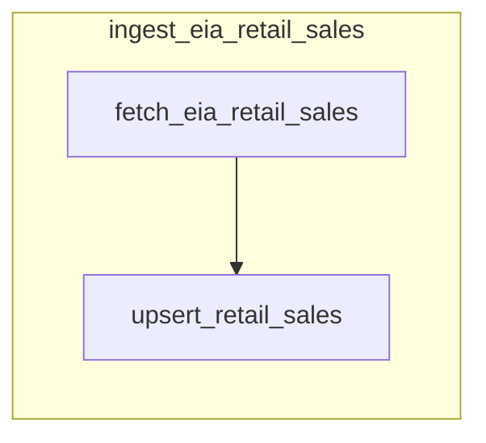

# Prefect flow/task structure for UI visibility and future expansion

## Current behavior

- [eia_retail_sales.py](src/energy_usa/flows/eia_retail_sales.py) defines a single `@flow` with no `@task`. All work (config, pagination, EIA calls, upserts) runs inside the flow. Prefect only shows **task** runs in the run graph, so the UI shows a completed flow with no tasks.

## Target behavior

- **Tasks visible in UI:** At least two task runs per flow run (fetch, upsert).
- **Clear separation:** Flow orchestrates; tasks do the work. Easy to add steps (e.g. validate, transform, notify) later.
- **Future-proof:** Same pattern works for additional ingest flows and for a parent flow that runs multiple ingests.

## Architecture

- **Flow:** Validate config (EIA_API_KEY, DATABASE_URL), call fetch task, then upsert task, return total rows.
- **Task 1 – fetch_eia_retail_sales:** Accept EIA config (base_url, api_key, timeouts, etc.). Create EIAManager, paginate `retail-sales/data` (existing loop), collect all rows into one list, close manager, return list of row dicts. No DB.
- **Task 2 – upsert_retail_sales:** Accept `database_url: str` and `rows: list[dict]`. Open connection via [get_connection](src/energy_usa/db/retail_sales.py), call existing [upsert_retail_sales](src/energy_usa/db/retail_sales.py)(conn, rows), close conn, return count.

Data flow: flow passes settings into fetch task; fetch returns in-memory list; flow passes `database_url` and that list into upsert task. Prefect serializes task return values; for very large result sets, consider the per-page variant below.

## Implementation steps

1. **Add two Prefect tasks in [src/energy_usa/flows/eia_retail_sales.py](src/energy_usa/flows/eia_retail_sales.py)**
  - `@task` **fetch_eia_retail_sales**: parameters for EIA (base_url, api_key, timeout, max_concurrent, max_retries). Instantiate EIAManager, run the current pagination loop (same `get_electricity("retail-sales/data", length=5000, offset=...)` and response parsing), accumulate all `data` lists into one list, `await manager.aclose()`, return the combined list. No database.
  - `@task` **upsert_retail_sales**: parameters `database_url: str`, `rows: list[dict]`. Inside task: `conn = get_connection(database_url)`, try/finally close, call `upsert_retail_sales(conn, rows)`, return rows affected.
2. **Refactor the flow to be thin**
  - In `ingest_eia_retail_sales`: load Settings, validate EIA_API_KEY and DATABASE_URL (existing checks). Call `data = fetch_eia_retail_sales(...)` with manager args from settings, then `total = upsert_retail_sales(settings.database_url, data)`, return total. Remove the in-flow pagination and DB logic (moved into tasks).
3. **Retries and naming**
  - Keep `retries=2` on the flow, or move retries to tasks if you want per-step retry (e.g. retry only fetch or only upsert). Give tasks clear names (e.g. `name="fetch-eia-retail-sales"`) so they are recognizable in the UI.
4. **No deployment changes**
  - [scripts/deploy_ingest.py](scripts/deploy_ingest.py) continues to deploy the same flow entrypoint; no changes required.

## Optional: per-page tasks (for huge datasets or per-page retries)

If the full-dataset list is too large to pass between tasks or you want per-page visibility/retries, use two task types called in a loop from the flow:

- `fetch_eia_retail_sales_page(offset, page_length, eia_config)` → returns one page of rows.
- `upsert_retail_sales_batch(database_url, rows)` → upserts one batch.

Flow would loop: fetch page → upsert batch, increment offset until no more data. Each page yields two task runs. Prefer the two-task (fetch-all / upsert-all) approach first unless you hit size or retry needs.

## Future expansion (multi-step and multi-ingest)

- **More steps in one flow:** Add tasks (e.g. validate_schema, send_slack_notification) and call them from the flow in order; each appears as a node in the UI.
- **More ingest types:** Add new flow modules (e.g. `eia_natural_gas.py`) with the same pattern: thin flow + fetch task + upsert task (or subflow that contains those tasks).
- **Parent flow:** When you want one schedule to run multiple ingests, add a flow (e.g. `nightly_ingest`) that calls `ingest_eia_retail_sales()` and other ingest flows as **subflows**. Prefect will show the parent run and child flow runs (and their tasks) in the graph.

## Files to touch

- **[src/energy_usa/flows/eia_retail_sales.py](src/energy_usa/flows/eia_retail_sales.py)** only: add `from prefect import flow, task`; implement the two tasks and slim down the flow to orchestrate them. No changes to [energy_usa.db](src/energy_usa/db/retail_sales.py), [energy_usa.eia.manager](src/energy_usa/eia/manager.py), or [scripts/deploy_ingest.py](scripts/deploy_ingest.py) required.

