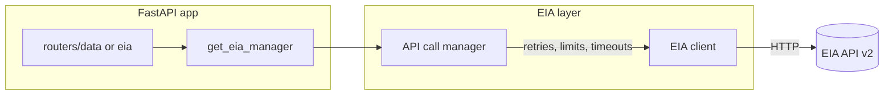

# Python project with uv, FastAPI, and EIA API call manager

## Scope

- **In scope:** Project bootstrap with uv, minimal FastAPI app, config, and the EIA API call manager (client + concurrency/retry layer) per [.cursor/rules/PROJECT.md](.cursor/rules/PROJECT.md). No database, UI, or Docker in this phase.
- **Out of scope:** Postgres, schemas, Web UI, Docker Compose (can be added later).

## 1. Project setup with uv

- **Initialize:** Run `uv init` at repo root to create `pyproject.toml` and default package. Prefer a `src` layout (e.g. `src/energy_usa/`) so the app runs as an installed package.
- **Dependencies (add with `uv add`):**
  - `fastapi`, `uvicorn[standard]` – API server
  - `httpx` – HTTP client for EIA (async-friendly)
  - `pydantic-settings` – typed config from env (e.g. `EIA_API_KEY`, `EIA_BASE_URL`)
- **EIA API key:** Document that users must set `EIA_API_KEY` (from [EIA Open Data registration](https://www.eia.gov/opendata/register.php)); do not hardcode.

## 2. FastAPI application skeleton

- **Entrypoint:** `src/energy_usa/main.py` – create `FastAPI()` app, include routers, and a `if __name__ == "__main__"` that runs `uvicorn.run(..., host="0.0.0.0", port=8000)`.
- **Config module:** e.g. `src/energy_usa/config.py` – use `pydantic-settings` to load `EIA_BASE_URL` (default EIA API v2 base), `EIA_API_KEY`, and optional timeouts/limits.
- **Health endpoint:** `GET /health` (or `/ready`) that returns a simple status without calling EIA (for future Docker/load balancers).
- **Routers:** Add a placeholder router (e.g. `routers/data.py` or `routers/eia.py`) that will later expose endpoints that use the API call manager; for the plan phase it can attach a single stub route so the app runs.

## 3. EIA API client (route-level)

- **Location:** e.g. `src/energy_usa/eia/client.py` (or `eia_client.py` at package root).
- **Responsibilities:**
  - Hold EIA base URL and API key; set header (e.g. `Authorization: ApiKey <key>` or query param per EIA v2 docs).
  - Expose one method per EIA route: `get_electricity`, `get_natural_gas`, `get_petroleum`, `get_coal`, `get_total_energy`.
  - Each method accepts optional query params: facets (e.g. `stateid`, `sectorid`), pagination (`length`, `offset`), `sort`; build path as `{base}/{route}/...` and forward params. Align with [docs/US Energy Pricing Data API.md](docs/US%20Energy%20Pricing%20Data%20API.md) (EIA v2 hierarchy, facets, 5,000-row limit).
- **HTTP:** Use `httpx` (sync or async). If the manager is async, use `httpx.AsyncClient` and async methods; if thread-based, use sync `httpx.Client` and the client methods can stay sync.

## 4. API call manager (concurrent, retries, limits)

- **Location:** e.g. `src/energy_usa/eia/manager.py` (or `api_call_manager.py`).
- **Concurrency:** Implement either:
  - **Option A (recommended):** Async manager using `asyncio` and `httpx.AsyncClient` with a semaphore (e.g. `asyncio.Semaphore(4)`) to cap concurrent EIA requests; fits FastAPI’s async model and avoids blocking the event loop.
  - **Option B:** Thread-based manager using `concurrent.futures.ThreadPoolExecutor` (e.g. 4–8 workers) that submits EIA client calls; add a simple rate limiter (e.g. token bucket or sleep between requests) if EIA has rate limits.
- **Behavior:**
  - **Retries:** Retry on transient failures (e.g. 5xx, timeouts) with exponential backoff and a max attempt count.
  - **Timeouts:** Set request timeouts (e.g. 30s) on every call.
  - **Single point of use:** All EIA access goes through this manager; the manager calls the EIA client methods. FastAPI endpoints depend on the manager (e.g. via a `get_eia_manager()` dependency that returns a shared instance).
- **Lifetime:** Create one manager instance at startup (e.g. in a `lifespan` or `on_event("startup")`), inject it into the app state or dependency, and close the HTTP client on shutdown.

## 5. Wire manager into FastAPI

- **Dependency:** Register a dependency (e.g. `get_eia_manager()`) that returns the shared EIA manager instance from app state.
- **Stub endpoint:** In the data/EIA router, add at least one endpoint (e.g. `GET /api/eia/electricity` or `/api/data/electricity`) that calls the manager’s electricity method with optional query params (e.g. `state_id`, `length`, `offset`) and returns the raw or lightly parsed JSON. This validates the full path: FastAPI → manager → EIA client → EIA API.

## 6. Run and validate

- **Run:** `uv run uvicorn energy_usa.main:app --reload` (adjust package name to match `pyproject.toml`).
- **Check:** Hit `/health` and the stub EIA endpoint (with valid `EIA_API_KEY`) to confirm the manager and client work.

## Architecture (high level)

## File layout (suggested)

- `pyproject.toml` – project and deps (uv)
- `src/energy_usa/__init__.py`
- `src/energy_usa/main.py` – FastAPI app, lifespan, router include
- `src/energy_usa/config.py` – pydantic-settings
- `src/energy_usa/eia/__init__.py`
- `src/energy_usa/eia/client.py` – 5 route methods, base URL + key
- `src/energy_usa/eia/manager.py` – concurrency, retries, timeouts; uses client
- `src/energy_usa/routers/data.py` (or `eia.py`) – stub route + dependency on manager

## Optional follow-ups (not in this plan)

- Add `.env.example` with `EIA_API_KEY=` and `EIA_BASE_URL=`.
- Add a brief README section on running with uv and required env vars.
- Later: Postgres, electricity schema, Docker Compose, UI.
