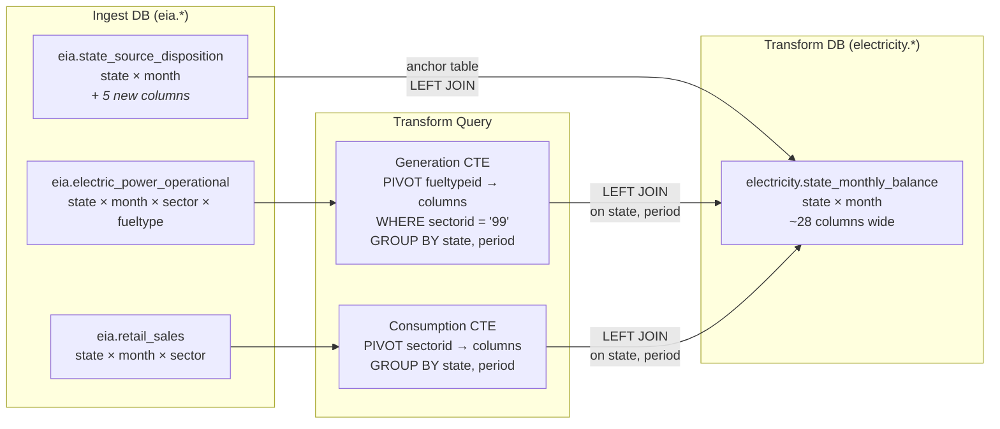

# State Monthly Balance Implementation Plan

> **For agentic workers:** REQUIRED SUB-SKILL: Use superpowers:subagent-driven-development (recommended) or superpowers:executing-plans to implement this plan task-by-task. Steps use checkbox (`- [ ]`) syntax for tracking.

**Goal:** Build `electricity.state_monthly_balance` — a wide table giving each state's monthly electricity production by fuel type, international/interstate trade, and consumption by retail sector.

**Architecture:** Extend the `state_source_disposition` ingest to capture 5 new API fields, then build a new transform that LEFT JOINs three ingest tables (electric_power_operational, state_source_disposition, retail_sales) and pivots fuel types and sectors into wide columns.

**Tech Stack:** PostgreSQL, psycopg3, Prefect 2, EIA API v2

**Spec:** `docs/superpowers/specs/2026-04-13-state-monthly-balance-design.md`

---

## Data Flow



## Sector and Fuel Type Codes

**`electric_power_operational.sectorid = '99'`** = overall total across all generator categories (utility, IPP, CHP, etc.). Using '99' avoids double-counting generation across producer types.

**Fuel type pivots** (from `fueltypeid`):
| Column | Code(s) | Category |
|--------|---------|----------|
| gen_coal_mwh | COW | fossil |
| gen_natural_gas_mwh | NG | fossil |
| gen_nuclear_mwh | NUC | — |
| gen_hydro_mwh | HYC | renewable |
| gen_solar_mwh | SUN | renewable |
| gen_wind_mwh | WND | renewable |
| gen_geothermal_mwh | GEO | renewable |
| gen_biomass_mwh | BIO | renewable |
| gen_petroleum_mwh | PEL, PC | fossil |

**Rollups:**
- `gen_fossil_mwh` = coal + natural_gas + petroleum
- `gen_renewable_mwh` = hydro + solar + wind + geothermal + biomass
- `gen_total_mwh` = from `state_source_disposition.total_net_generation` (authoritative EIA total)
- `gen_other_mwh` = gen_total - fossil - nuclear - renewable (catches residual to avoid double-counting)

**Consumption pivots** (from `retail_sales.sectorid`):
| Column | Code |
|--------|------|
| consumption_residential_mwh | RES |
| consumption_commercial_mwh | COM |
| consumption_industrial_mwh | IND |
| consumption_transportation_mwh | TRA |
| consumption_other_mwh | OTH |
| consumption_total_mwh | ALL |

---

## Task 1: Extend state_source_disposition ingest — DDL + spec

**Files:**
- Modify: `docker/postgres/init/ingest/eia/state_source_disposition.sql`
- Modify: `specs/ingest/eia.md` (state_source_disposition section, around line 581)

- [ ] **Step 1: Add 5 new columns to DDL**

```sql
-- docker/postgres/init/ingest/eia/state_source_disposition.sql
CREATE TABLE IF NOT EXISTS eia.state_source_disposition (
    period DATE NOT NULL,
    stateid TEXT NOT NULL,
    total_net_generation NUMERIC,
    total_international_imports NUMERIC,
    total_international_exports NUMERIC,
    net_interstate_trade NUMERIC,
    total_supply NUMERIC,
    total_disposition NUMERIC,
    estimated_losses NUMERIC,
    ingested_at TIMESTAMPTZ NOT NULL DEFAULT now(),
    PRIMARY KEY (period, stateid)
);
```

- [ ] **Step 2: Add 5 new columns to the live database**

The DDL only runs on first init. For the running database:

```bash
docker compose exec -T postgres psql -U energy -d ingest -c "
ALTER TABLE eia.state_source_disposition
    ADD COLUMN IF NOT EXISTS total_net_generation NUMERIC,
    ADD COLUMN IF NOT EXISTS total_international_imports NUMERIC,
    ADD COLUMN IF NOT EXISTS total_international_exports NUMERIC,
    ADD COLUMN IF NOT EXISTS total_supply NUMERIC,
    ADD COLUMN IF NOT EXISTS estimated_losses NUMERIC;
"
```

- [ ] **Step 3: Update the ingest spec**

In `specs/ingest/eia.md`, replace the `state_source_disposition` Columns table with:

```markdown
- **Columns**:
  | Column | API field | Type | Required | Default |
  |--------|-----------|------|----------|---------|
  | period | period | DATE | yes | |
  | stateid | stateid; state | TEXT | yes | |
  | total_net_generation | total-net-generation; total_net_generation | NUMERIC | no | |
  | total_international_imports | total-international-imports; total_international_imports | NUMERIC | no | |
  | total_international_exports | total-international-exports; total_international_exports | NUMERIC | no | |
  | net_interstate_trade | net-interstate-trade; net_interstate_trade | NUMERIC | no | |
  | total_supply | total-supply; total_supply | NUMERIC | no | |
  | total_disposition | total-disposition; total_disposition | NUMERIC | no | |
  | estimated_losses | estimated-losses; estimated_losses | NUMERIC | no | |
```

- [ ] **Step 4: Commit**

```bash
git add docker/postgres/init/ingest/eia/state_source_disposition.sql specs/ingest/eia.md
git commit -m "extend state_source_disposition with supply/trade columns for balance transform"
```

---

## Task 2: Extend state_source_disposition ingest — Python upsert + flow

**Files:**
- Modify: `src/energy_usa/db/ingest/eia/state_source_disposition.py`
- Modify: `src/energy_usa/flows/ingest/eia/state_source_disposition.py`

- [ ] **Step 1: Update the upsert function to handle new columns**

Replace the full content of `src/energy_usa/db/ingest/eia/state_source_disposition.py`:

```python
"""Upsert EIA state-electricity-profiles source-disposition rows into Postgres.

Uses the eia.state_source_disposition table with unique (period, stateid).
Expects row dicts from the EIA API with hyphenated keys (e.g.
``total-net-generation``); we normalize to snake_case for Postgres columns.
Period is stored as DATE (first day of month); cadence is monthly.
"""

from typing import Any

import psycopg

from energy_usa.db.period import normalize_period


def _get(row: dict, *keys: str) -> Any:
    """Return the first non-None value for the given keys."""
    for k in keys:
        v = row.get(k)
        if v is not None:
            return v
    return None


def upsert_state_source_disposition(
    conn: psycopg.Connection, rows: list[dict[str, Any]]
) -> int:
    """Upsert EIA source-disposition rows into eia.state_source_disposition.

    Each row must have period and stateid. All other columns are optional.
    EIA API returns hyphenated keys; we normalize to snake_case.
    On conflict on (period, stateid) existing rows are updated.

    :param conn: An open psycopg connection.
    :param rows: List of dicts from the EIA API.
    :returns: Number of rows affected (inserted or updated).
    """
    if not rows:
        return 0
    sql = """
    INSERT INTO eia.state_source_disposition (
        period, stateid,
        total_net_generation, total_international_imports,
        total_international_exports, net_interstate_trade,
        total_supply, total_disposition, estimated_losses,
        ingested_at
    )
    VALUES (
        %(period)s, %(stateid)s,
        %(total_net_generation)s, %(total_international_imports)s,
        %(total_international_exports)s, %(net_interstate_trade)s,
        %(total_supply)s, %(total_disposition)s, %(estimated_losses)s,
        now()
    )
    ON CONFLICT (period, stateid)
    DO UPDATE SET
        total_net_generation       = EXCLUDED.total_net_generation,
        total_international_imports = EXCLUDED.total_international_imports,
        total_international_exports = EXCLUDED.total_international_exports,
        net_interstate_trade       = EXCLUDED.net_interstate_trade,
        total_supply               = EXCLUDED.total_supply,
        total_disposition          = EXCLUDED.total_disposition,
        estimated_losses           = EXCLUDED.estimated_losses,
        ingested_at                = now()
    """
    normalized = []
    for r in rows:
        period_date = normalize_period(r.get("period"), "monthly")
        if period_date is None:
            continue
        normalized.append({
            "period": period_date,
            "stateid": r.get("stateid") or r.get("state"),
            "total_net_generation": _get(r, "total-net-generation", "total_net_generation"),
            "total_international_imports": _get(r, "total-international-imports", "total_international_imports"),
            "total_international_exports": _get(r, "total-international-exports", "total_international_exports"),
            "net_interstate_trade": _get(r, "net-interstate-trade", "net_interstate_trade"),
            "total_supply": _get(r, "total-supply", "total_supply"),
            "total_disposition": _get(r, "total-disposition", "total_disposition"),
            "estimated_losses": _get(r, "estimated-losses", "estimated_losses"),
        })
    if not normalized:
        return 0
    with conn.cursor() as cur:
        cur.executemany(sql, normalized)
    conn.commit()
    return len(normalized)
```

- [ ] **Step 2: Update the flow to request new data columns from the API**

In `src/energy_usa/flows/ingest/eia/state_source_disposition.py`, change the data columns constant:

```python
# Data columns to request; EIA returns hyphenated keys.
EIA_SOURCE_DISPOSITION_DATA_COLUMNS = [
    "total-net-generation",
    "total-international-imports",
    "total-international-exports",
    "net-interstate-trade",
    "total-supply",
    "total-disposition",
    "estimated-losses",
]
```

- [ ] **Step 3: Verify it compiles**

```bash
uv run python -c "from energy_usa.flows.ingest.eia.state_source_disposition import ingest_eia_state_source_disposition; print('ok')"
```

Expected: `ok`

- [ ] **Step 4: Commit**

```bash
git add src/energy_usa/db/ingest/eia/state_source_disposition.py \
        src/energy_usa/flows/ingest/eia/state_source_disposition.py
git commit -m "add supply/trade columns to state_source_disposition ingest"
```

---

## Task 3: Create state_monthly_balance DDL + transform spec

**Files:**
- Create: `docker/postgres/init/transform/electricity/state_monthly_balance.sql`
- Modify: `specs/transform/electricity.md`

- [ ] **Step 1: Create the transform DDL**

```sql
-- docker/postgres/init/transform/electricity/state_monthly_balance.sql
-- Wide table: state electricity supply, trade, and consumption by month.
-- Grain: state + month. Sources: eia.electric_power_operational,
-- eia.state_source_disposition, eia.retail_sales.
CREATE TABLE IF NOT EXISTS electricity.state_monthly_balance (
    state TEXT NOT NULL,
    period DATE NOT NULL,
    -- Generation by fuel type
    gen_coal_mwh NUMERIC,
    gen_natural_gas_mwh NUMERIC,
    gen_nuclear_mwh NUMERIC,
    gen_hydro_mwh NUMERIC,
    gen_solar_mwh NUMERIC,
    gen_wind_mwh NUMERIC,
    gen_geothermal_mwh NUMERIC,
    gen_biomass_mwh NUMERIC,
    gen_petroleum_mwh NUMERIC,
    -- Rollups
    gen_fossil_mwh NUMERIC,
    gen_renewable_mwh NUMERIC,
    gen_other_mwh NUMERIC,
    gen_total_mwh NUMERIC,
    -- Trade
    international_imports_mwh NUMERIC,
    international_exports_mwh NUMERIC,
    net_interstate_trade_mwh NUMERIC,
    total_supply_mwh NUMERIC,
    -- Consumption by sector
    consumption_residential_mwh NUMERIC,
    consumption_commercial_mwh NUMERIC,
    consumption_industrial_mwh NUMERIC,
    consumption_transportation_mwh NUMERIC,
    consumption_other_mwh NUMERIC,
    consumption_total_mwh NUMERIC,
    -- Losses
    estimated_losses_mwh NUMERIC,
    transformed_at TIMESTAMPTZ NOT NULL DEFAULT now(),
    PRIMARY KEY (state, period)
);
```

- [ ] **Step 2: Add the table to the live transform database**

```bash
docker compose exec -T postgres psql -U energy -d transform -f /docker-entrypoint-initdb.d/transform/electricity/state_monthly_balance.sql
```

Wait — that file isn't mounted yet. Run the SQL directly:

```bash
docker compose exec -T postgres psql -U energy -d transform < docker/postgres/init/transform/electricity/state_monthly_balance.sql
```

- [ ] **Step 3: Add the spec to `specs/transform/electricity.md`**

Append the new section after the existing `retail_by_state` spec:

```markdown
## electricity.state_monthly_balance
Wide table giving each state's monthly electricity production by fuel type,
international/interstate trade, and consumption by retail sector.

- **Source tables**: eia.electric_power_operational, eia.state_source_disposition, eia.retail_sales
- **Grain**: state, period (month)
- **Join logic**: state_source_disposition is the anchor (one row per state+month).
  LEFT JOIN generation (pivoted from electric_power_operational WHERE sectorid='99')
  and consumption (pivoted from retail_sales) on (stateid, period).
- **Output columns**:
  | Column | Source | Logic | Type |
  |--------|--------|-------|------|
  | state | state_source_disposition.stateid | direct | TEXT |
  | period | state_source_disposition.period | direct | DATE |
  | gen_coal_mwh | electric_power_operational | SUM generation WHERE fueltypeid='COW', sectorid='99' | NUMERIC |
  | gen_natural_gas_mwh | electric_power_operational | SUM WHERE fueltypeid='NG' | NUMERIC |
  | gen_nuclear_mwh | electric_power_operational | SUM WHERE fueltypeid='NUC' | NUMERIC |
  | gen_hydro_mwh | electric_power_operational | SUM WHERE fueltypeid='HYC' | NUMERIC |
  | gen_solar_mwh | electric_power_operational | SUM WHERE fueltypeid='SUN' | NUMERIC |
  | gen_wind_mwh | electric_power_operational | SUM WHERE fueltypeid='WND' | NUMERIC |
  | gen_geothermal_mwh | electric_power_operational | SUM WHERE fueltypeid='GEO' | NUMERIC |
  | gen_biomass_mwh | electric_power_operational | SUM WHERE fueltypeid='BIO' | NUMERIC |
  | gen_petroleum_mwh | electric_power_operational | SUM WHERE fueltypeid IN ('PEL','PC') | NUMERIC |
  | gen_fossil_mwh | derived | coal + ng + petroleum | NUMERIC |
  | gen_renewable_mwh | derived | hydro + solar + wind + geo + biomass | NUMERIC |
  | gen_total_mwh | state_source_disposition.total_net_generation | direct | NUMERIC |
  | gen_other_mwh | derived | total - fossil - nuclear - renewable | NUMERIC |
  | international_imports_mwh | state_source_disposition.total_international_imports | direct | NUMERIC |
  | international_exports_mwh | state_source_disposition.total_international_exports | direct | NUMERIC |
  | net_interstate_trade_mwh | state_source_disposition.net_interstate_trade | direct | NUMERIC |
  | total_supply_mwh | state_source_disposition.total_supply | direct | NUMERIC |
  | consumption_residential_mwh | retail_sales | SUM sales WHERE sectorid='RES' | NUMERIC |
  | consumption_commercial_mwh | retail_sales | SUM sales WHERE sectorid='COM' | NUMERIC |
  | consumption_industrial_mwh | retail_sales | SUM sales WHERE sectorid='IND' | NUMERIC |
  | consumption_transportation_mwh | retail_sales | SUM sales WHERE sectorid='TRA' | NUMERIC |
  | consumption_other_mwh | retail_sales | SUM sales WHERE sectorid='OTH' | NUMERIC |
  | consumption_total_mwh | retail_sales | SUM sales WHERE sectorid='ALL' | NUMERIC |
  | estimated_losses_mwh | state_source_disposition.estimated_losses | direct | NUMERIC |
- **Unique key**: (state, period)
```

- [ ] **Step 4: Commit**

```bash
git add docker/postgres/init/transform/electricity/state_monthly_balance.sql \
        specs/transform/electricity.md
git commit -m "add state_monthly_balance DDL and transform spec"
```

---

## Task 4: Implement state_monthly_balance query and upsert

**Files:**
- Create: `src/energy_usa/db/transform/electricity/state_monthly_balance.py`

- [ ] **Step 1: Create the transform module**

```python
# src/energy_usa/db/transform/electricity/state_monthly_balance.py
"""Transform functions for the electricity.state_monthly_balance table.

Reads from three ingest tables and joins them into a wide state × month view:

* ``eia.electric_power_operational`` — generation pivoted by fuel type
* ``eia.state_source_disposition`` — supply, trade, and disposition totals
* ``eia.retail_sales`` — consumption pivoted by retail sector

The query uses CTEs for the generation and consumption pivots, then LEFT JOINs
them onto ``state_source_disposition`` (the anchor, one row per state + month).
"""

from typing import Any

import psycopg

_QUERY_SQL = """
WITH generation AS (
    SELECT
        stateid,
        period,
        SUM(CASE WHEN fueltypeid = 'COW' THEN generation END) AS gen_coal_mwh,
        SUM(CASE WHEN fueltypeid = 'NG'  THEN generation END) AS gen_natural_gas_mwh,
        SUM(CASE WHEN fueltypeid = 'NUC' THEN generation END) AS gen_nuclear_mwh,
        SUM(CASE WHEN fueltypeid = 'HYC' THEN generation END) AS gen_hydro_mwh,
        SUM(CASE WHEN fueltypeid = 'SUN' THEN generation END) AS gen_solar_mwh,
        SUM(CASE WHEN fueltypeid = 'WND' THEN generation END) AS gen_wind_mwh,
        SUM(CASE WHEN fueltypeid = 'GEO' THEN generation END) AS gen_geothermal_mwh,
        SUM(CASE WHEN fueltypeid = 'BIO' THEN generation END) AS gen_biomass_mwh,
        SUM(CASE WHEN fueltypeid IN ('PEL', 'PC') THEN generation END) AS gen_petroleum_mwh
    FROM eia.electric_power_operational
    WHERE sectorid = '99'
      AND fueltypeid IN ('COW', 'NG', 'NUC', 'HYC', 'SUN', 'WND', 'GEO', 'BIO', 'PEL', 'PC')
    GROUP BY stateid, period
),
consumption AS (
    SELECT
        stateid,
        period,
        SUM(CASE WHEN sectorid = 'RES' THEN sales END) AS consumption_residential_mwh,
        SUM(CASE WHEN sectorid = 'COM' THEN sales END) AS consumption_commercial_mwh,
        SUM(CASE WHEN sectorid = 'IND' THEN sales END) AS consumption_industrial_mwh,
        SUM(CASE WHEN sectorid = 'TRA' THEN sales END) AS consumption_transportation_mwh,
        SUM(CASE WHEN sectorid = 'OTH' THEN sales END) AS consumption_other_mwh,
        SUM(CASE WHEN sectorid = 'ALL' THEN sales END) AS consumption_total_mwh
    FROM eia.retail_sales
    WHERE stateid != 'US'
    GROUP BY stateid, period
)
SELECT
    ssd.stateid AS state,
    ssd.period,
    -- Granular generation
    g.gen_coal_mwh,
    g.gen_natural_gas_mwh,
    g.gen_nuclear_mwh,
    g.gen_hydro_mwh,
    g.gen_solar_mwh,
    g.gen_wind_mwh,
    g.gen_geothermal_mwh,
    g.gen_biomass_mwh,
    g.gen_petroleum_mwh,
    -- Fossil rollup: coal + ng + petroleum
    COALESCE(g.gen_coal_mwh, 0)
        + COALESCE(g.gen_natural_gas_mwh, 0)
        + COALESCE(g.gen_petroleum_mwh, 0) AS gen_fossil_mwh,
    -- Renewable rollup: hydro + solar + wind + geo + biomass
    COALESCE(g.gen_hydro_mwh, 0)
        + COALESCE(g.gen_solar_mwh, 0)
        + COALESCE(g.gen_wind_mwh, 0)
        + COALESCE(g.gen_geothermal_mwh, 0)
        + COALESCE(g.gen_biomass_mwh, 0) AS gen_renewable_mwh,
    -- Authoritative total from EIA (not sum of fuel pivots)
    ssd.total_net_generation AS gen_total_mwh,
    -- Other = total - fossil - nuclear - renewable (catches residual)
    COALESCE(ssd.total_net_generation, 0)
        - (COALESCE(g.gen_coal_mwh, 0) + COALESCE(g.gen_natural_gas_mwh, 0) + COALESCE(g.gen_petroleum_mwh, 0))
        - COALESCE(g.gen_nuclear_mwh, 0)
        - (COALESCE(g.gen_hydro_mwh, 0) + COALESCE(g.gen_solar_mwh, 0) + COALESCE(g.gen_wind_mwh, 0)
           + COALESCE(g.gen_geothermal_mwh, 0) + COALESCE(g.gen_biomass_mwh, 0))
        AS gen_other_mwh,
    -- Trade
    ssd.total_international_imports AS international_imports_mwh,
    ssd.total_international_exports AS international_exports_mwh,
    ssd.net_interstate_trade AS net_interstate_trade_mwh,
    ssd.total_supply AS total_supply_mwh,
    -- Consumption
    c.consumption_residential_mwh,
    c.consumption_commercial_mwh,
    c.consumption_industrial_mwh,
    c.consumption_transportation_mwh,
    c.consumption_other_mwh,
    c.consumption_total_mwh,
    -- Losses
    ssd.estimated_losses AS estimated_losses_mwh
FROM eia.state_source_disposition ssd
LEFT JOIN generation g ON g.stateid = ssd.stateid AND g.period = ssd.period
LEFT JOIN consumption c ON c.stateid = ssd.stateid AND c.period = ssd.period
WHERE ssd.stateid != 'US'
ORDER BY ssd.stateid, ssd.period
"""

_UPSERT_SQL = """
INSERT INTO electricity.state_monthly_balance (
    state, period,
    gen_coal_mwh, gen_natural_gas_mwh, gen_nuclear_mwh,
    gen_hydro_mwh, gen_solar_mwh, gen_wind_mwh,
    gen_geothermal_mwh, gen_biomass_mwh, gen_petroleum_mwh,
    gen_fossil_mwh, gen_renewable_mwh, gen_other_mwh, gen_total_mwh,
    international_imports_mwh, international_exports_mwh,
    net_interstate_trade_mwh, total_supply_mwh,
    consumption_residential_mwh, consumption_commercial_mwh,
    consumption_industrial_mwh, consumption_transportation_mwh,
    consumption_other_mwh, consumption_total_mwh,
    estimated_losses_mwh
)
VALUES (
    %(state)s, %(period)s,
    %(gen_coal_mwh)s, %(gen_natural_gas_mwh)s, %(gen_nuclear_mwh)s,
    %(gen_hydro_mwh)s, %(gen_solar_mwh)s, %(gen_wind_mwh)s,
    %(gen_geothermal_mwh)s, %(gen_biomass_mwh)s, %(gen_petroleum_mwh)s,
    %(gen_fossil_mwh)s, %(gen_renewable_mwh)s, %(gen_other_mwh)s, %(gen_total_mwh)s,
    %(international_imports_mwh)s, %(international_exports_mwh)s,
    %(net_interstate_trade_mwh)s, %(total_supply_mwh)s,
    %(consumption_residential_mwh)s, %(consumption_commercial_mwh)s,
    %(consumption_industrial_mwh)s, %(consumption_transportation_mwh)s,
    %(consumption_other_mwh)s, %(consumption_total_mwh)s,
    %(estimated_losses_mwh)s
)
ON CONFLICT (state, period) DO UPDATE SET
    gen_coal_mwh                   = EXCLUDED.gen_coal_mwh,
    gen_natural_gas_mwh            = EXCLUDED.gen_natural_gas_mwh,
    gen_nuclear_mwh                = EXCLUDED.gen_nuclear_mwh,
    gen_hydro_mwh                  = EXCLUDED.gen_hydro_mwh,
    gen_solar_mwh                  = EXCLUDED.gen_solar_mwh,
    gen_wind_mwh                   = EXCLUDED.gen_wind_mwh,
    gen_geothermal_mwh             = EXCLUDED.gen_geothermal_mwh,
    gen_biomass_mwh                = EXCLUDED.gen_biomass_mwh,
    gen_petroleum_mwh              = EXCLUDED.gen_petroleum_mwh,
    gen_fossil_mwh                 = EXCLUDED.gen_fossil_mwh,
    gen_renewable_mwh              = EXCLUDED.gen_renewable_mwh,
    gen_other_mwh                  = EXCLUDED.gen_other_mwh,
    gen_total_mwh                  = EXCLUDED.gen_total_mwh,
    international_imports_mwh      = EXCLUDED.international_imports_mwh,
    international_exports_mwh      = EXCLUDED.international_exports_mwh,
    net_interstate_trade_mwh       = EXCLUDED.net_interstate_trade_mwh,
    total_supply_mwh               = EXCLUDED.total_supply_mwh,
    consumption_residential_mwh    = EXCLUDED.consumption_residential_mwh,
    consumption_commercial_mwh     = EXCLUDED.consumption_commercial_mwh,
    consumption_industrial_mwh     = EXCLUDED.consumption_industrial_mwh,
    consumption_transportation_mwh = EXCLUDED.consumption_transportation_mwh,
    consumption_other_mwh          = EXCLUDED.consumption_other_mwh,
    consumption_total_mwh          = EXCLUDED.consumption_total_mwh,
    estimated_losses_mwh           = EXCLUDED.estimated_losses_mwh,
    transformed_at                 = now()
"""


def query_state_monthly_balance(conn: psycopg.Connection) -> list[dict[str, Any]]:
    """Query the state monthly electricity balance from ingest tables.

    Joins ``eia.electric_power_operational`` (generation by fuel),
    ``eia.state_source_disposition`` (trade + totals), and
    ``eia.retail_sales`` (consumption by sector) into one wide row per
    (state, month). National totals (stateid = 'US') are excluded.

    :param conn: An open psycopg connection to the **ingest** database.
    :returns: List of dicts, one per (state, period).
    """
    with conn.cursor() as cur:
        cur.execute(_QUERY_SQL)
        return cur.fetchall()


def upsert_state_monthly_balance(
    conn: psycopg.Connection, rows: list[dict[str, Any]]
) -> int:
    """Upsert state monthly balance rows into ``electricity.state_monthly_balance``.

    Idempotent via ``ON CONFLICT (state, period) DO UPDATE``.

    :param conn: An open psycopg connection to the **transform** database.
    :param rows: List of dicts as returned by :func:`query_state_monthly_balance`.
    :returns: Number of rows upserted (0 if empty).
    """
    if not rows:
        return 0
    with conn.cursor() as cur:
        cur.executemany(_UPSERT_SQL, rows)
    conn.commit()
    return len(rows)
```

- [ ] **Step 2: Verify it compiles**

```bash
uv run python -c "from energy_usa.db.transform.electricity.state_monthly_balance import query_state_monthly_balance, upsert_state_monthly_balance; print('ok')"
```

Expected: `ok`

- [ ] **Step 3: Commit**

```bash
git add src/energy_usa/db/transform/electricity/state_monthly_balance.py
git commit -m "add state_monthly_balance query + upsert module"
```

---

## Task 5: Wire state_monthly_balance into the transform flow

**Files:**
- Modify: `src/energy_usa/flows/transform/electricity.py`

- [ ] **Step 1: Add the new task and register it in the flow**

Add a new import and task function after the existing `transform_retail_by_state_task`, then add it to `all_tables`:

Import to add at the top:

```python
from energy_usa.db.transform.electricity.state_monthly_balance import query_state_monthly_balance, upsert_state_monthly_balance
```

New task (after `transform_retail_by_state_task`):

```python
@task(name="transform-state-monthly-balance")
def transform_state_monthly_balance_task(ingest_url: str, transform_url: str) -> int:
    logger = get_run_logger()
    ingest_conn = get_connection(ingest_url)
    try:
        rows = query_state_monthly_balance(ingest_conn)
        logger.info("Queried %d state_monthly_balance rows from ingest", len(rows))
    finally:
        ingest_conn.close()
    transform_conn = get_connection(transform_url)
    try:
        count = upsert_state_monthly_balance(transform_conn, rows)
        logger.info("Upserted %d rows into electricity.state_monthly_balance", count)
        return count
    finally:
        transform_conn.close()
```

Update the `all_tables` dict inside `transform_electricity`:

```python
    all_tables = {
        "generation_mix": transform_generation_mix_task,
        "retail_by_state": transform_retail_by_state_task,
        "state_monthly_balance": transform_state_monthly_balance_task,
    }
```

- [ ] **Step 2: Verify it compiles**

```bash
uv run python -c "from energy_usa.flows.transform.electricity import transform_electricity; print('ok')"
```

Expected: `ok`

- [ ] **Step 3: Commit**

```bash
git add src/energy_usa/flows/transform/electricity.py
git commit -m "wire state_monthly_balance into electricity transform flow"
```

---

## Task 6: Re-backfill state_source_disposition + run transform

- [ ] **Step 1: Rebuild the worker image** (picks up new ingest code)

```bash
docker compose build prefect-worker
docker compose up -d --no-deps prefect-worker
```

- [ ] **Step 2: Redeploy Prefect deployments**

```bash
make deploy
```

- [ ] **Step 3: Backfill state_source_disposition to pick up new columns**

```bash
make backfill DATASET=state_source_disposition START=2020-01 END=2026-04
```

Monitor in the Prefect UI until the run completes. Then verify the new columns have data:

```bash
docker compose exec -T postgres psql -U energy -d ingest -c \
  "SELECT stateid, period, total_net_generation, total_international_imports, total_international_exports
   FROM eia.state_source_disposition WHERE stateid='CA' ORDER BY period DESC LIMIT 3;"
```

Expected: non-NULL values in the new columns.

- [ ] **Step 4: Run the electricity transform**

```bash
make transform DOMAIN=electricity TTABLE=state_monthly_balance
```

- [ ] **Step 5: Spot-check the output**

```bash
docker compose exec -T postgres psql -U energy -d transform -c \
  "SELECT state, period, gen_coal_mwh, gen_solar_mwh, gen_total_mwh,
          international_imports_mwh, net_interstate_trade_mwh,
          consumption_residential_mwh, consumption_total_mwh
   FROM electricity.state_monthly_balance
   WHERE state = 'TX' ORDER BY period DESC LIMIT 5;"
```

Expected: Texas rows with non-NULL values for coal, solar, consumption, and trade columns.

- [ ] **Step 6: Commit any remaining changes**

```bash
git add -A
git commit -m "run state_source_disposition re-backfill and verify state_monthly_balance transform"
```
